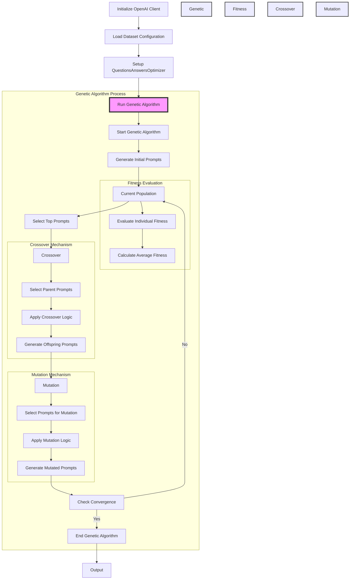

# GeneticPromptLab
GeneticPromptLab uses genetic algorithms for automated prompt engineering (for LLMs), enhancing quality and diversity through iterative selection, crossover, and mutation, while efficiently exploring minimal yet diverse samples from the training set.

## Overview

GeneticPromptLab is a Python library designed to harness the power of genetic algorithms for automated prompt engineering for large language models (LLMs). By iteratively applying selection, crossover, and mutation processes, GeneticPromptLab enhances the quality and diversity of prompts, leading to improved performance in automated question-answering and classification tasks.

This library specifically leverages Sentence Transformers for embedding generation and k-means clustering to sample minimal yet diverse data from training sets. This strategic sampling ensures efficient exploration and optimization of prompts over multiple generations.



## Features

- **Genetic Algorithm Implementation**: Complete genetic algorithm cycle including initialization, fitness evaluation, selection, crossover, and mutation for prompt engineering.
- **Integration with Sentence Transformers**: Utilizes Sentence Transformers for generating embeddings, enabling effective clustering and sampling.
- **Diverse Sampling**: Uses k-means clustering to select a representative subset of data, ensuring diverse genetic material for algorithm initialization and evolution.
- **Dynamic Mutation and Crossover**: Incorporates custom mutation and crossover operations tailored to prompt characteristics and task requirements.
- **Multi-Dataset Support**: Pre-configured to run experiments on the TREC and AG News datasets, demonstrating its adaptability to different types of text classification tasks.

## Installation

To install GeneticPromptLab, clone this repository and install the required packages:

```bash
git clone https://github.com/username/GeneticPromptLab.git
cd GeneticPromptLab
pip install -r requirements.txt
```

## Benchmarks

### Performance on TREC Dataset

The TREC dataset comprises 4,500 English questions categorized into various labels. Below is the performance improvement graph showing the evolution of prompt effectiveness over 10 generations.
#### Training Progression exploring only 10% of the training data


#### Best Prompt within 10 generations (100 samples explored) achieves 76.1% accuracy on test-set.

### Performance on AG News Dataset

The AG News dataset contains over 1 million news articles classified into categories like World, Sports, Business, and Sci/Tech. Below is the performance graph for the AG News dataset.
#### Training Progression exploring only 10% of the training data


#### Best Prompt within 10 generations (100 samples explored) achieves 80.5% accuracy on test-set.
## Quick Start

To run GeneticPromptLab on the AG News dataset:

```python
from GeneticPromptLab import QuestionsAnswersOptimizer, agnews
from openai import OpenAI

# Load API key
with open("openai_api.key", "r") as f:
    key = f.read().strip()

# Initialize client
client = OpenAI(api_key=key)

# Get AG News dataset & Initialize the optimizer
lab = QuestionsAnswersOptimizer(
        client=client, 
        problem_description=problem_description, 
        train_questions_list=train_questions_list, 
        train_answers_label=train_answers_label, 
        test_questions_list=test_questions_list, 
        test_answers_label=test_answers_label, 
        label_dict=label_dict, 
        model_name=model_name, 
        sample_p=sample_p, 
        init_and_fitness_sample=population_size, 
        window_size_init=2,
        num_retries=num_retries)

# Run the genetic algorithm
optimized_prompts = lab.genetic_algorithm()
print(optimized_prompts)
```
### Detailed Explanation of Arguments:

#### 1. `client`
- **Description**: This is the instance of the OpenAI client that the optimizer uses to send queries. It's essential for communicating with the GPT model.
- **Example Usage**: `client = OpenAI(api_key=key)`

#### 2. `problem_description`
- **Description**: A string that describes the problem context or dataset. This helps to set the stage for the prompts, providing the GPT model with a background for better understanding and response generation.
- **Example Usage**: Derived from the `agnews()` function which returns a detailed description of the AG News dataset.

#### 3. `train_questions_list`
- **Description**: A list of questions from the training dataset. These are used by the genetic algorithm to generate initial prompts and evaluate their effectiveness.
- **Example Usage**: List of questions derived from the `train_data['question'].tolist()` method in the `agnews()` function.

#### 4. `train_answers_label`
- **Description**: A list of corresponding labels for the training questions. These are crucial for training as they provide the correct answers for the questions.
- **Example Usage**: List of labels derived from the `train_data['label'].tolist()` method in the `agnews()` function.

#### 5. `test_questions_list`
- **Description**: A list of questions from the testing dataset. While primarily not used directly in training, they can be useful for additional validation if incorporated.
- **Example Usage**: Similar to `train_questions_list`, but derived from the test data.

#### 6. `test_answers_label`
- **Description**: Corresponding labels for the test questions. These are used to validate the effectiveness of the prompts on unseen data.
- **Example Usage**: Similar to `train_answers_label`, but for test data.

#### 7. `label_dict`
- **Description**: A dictionary mapping numerical labels to their descriptive counterparts. It helps in understanding and converting between numerical labels and their meaning.
- **Example Usage**: Loaded from a JSON file in the `agnews()` function.

#### 8. `model_name`
- **Description**: The name of the SentenceTransformer model used for encoding the questions into embeddings. The choice of model can significantly affect the clustering and thus the genetic algorithm's ability to sample distinct data points.
- **Example Usage**: `'multi-qa-MiniLM-L6-cos-v1'` as specified in the `agnews()` function.

#### 9. `sample_p`
- **Description**: The proportion of the training dataset to sample for running the genetic algorithm. A smaller sample can be used to speed up computations during development or in cases of limited computational resources.
- **Example Usage**: `0.01` means that 1% of the training data is used.

#### 10. `init_and_fitness_sample`
- **Description**: The initial number of prompts to generate and also the number of prompts evaluated for fitness each generation. This setting controls the breadth of exploration in the genetic space.
- **Example Usage**: `8` initializes and evaluates eight prompts per generation.

#### 11. `window_size_init`
- **Description**: This parameter controls the number of questions considered for creating a single prompt. It can affect the complexity and specificity of the generated prompts.
- **Example Usage**: `2` means that two questions are combined to create each prompt.

#### 12. `num_retries`
- **Description**: Specifies how many times the fitness of each prompt should be re-evaluated to ensure accuracy. This is important because the stochastic nature of GPT responses can lead to variability in performance.
- **Example Usage**: `2` retries for each prompt to average out the variability.

## Documentation

- **create_prompts(data)**: Generates prompts based on input data.
- **generate_init_prompts(n)**: Produces initial prompts for the genetic algorithm.
- **sample_distinct(n)**: Samples a distinct subset of data or embeddings.
- **genetic_algorithm(mutation_rate)**: Executes the genetic algorithm process.
- **evaluate_fitness(prompts)**: Evaluates the fitness of each prompt.
- **select_top_prompts(fitness_scores, population, top_fraction)**: Selects the top-performing prompts based on fitness scores.
- **crossover_using_gpt(prompts)**: Performs crossover between prompts.
- **mutate_prompts(prompts, mutation_rate)**: Applies mutations to the given prompts.

## Contributions and Feedback

Contributions, suggestions, and feedback are welcome! If you have any ideas to enhance the app or encounter any issues, please feel free to open an issue or submit a pull request on the GitHub repository. Thank you for your interest in our research work.

## Other Usage Details

### Attribution

* If you use or share this work, please provide attribution with the following information:

_"GeneticPromptLab" by Aman Priyanshu and Supriti Vijay, licensed under the MIT License

* When sharing adaptations of this work, please include a statement indicating that changes were made, such as:

_This work is adapted from "GeneticPromptLab" by Aman Priyanshu and Supriti Vijay, licensed under the MIT License. Original work available at: https://github.com/AmanPriyanshu/GeneticPromptLab_
